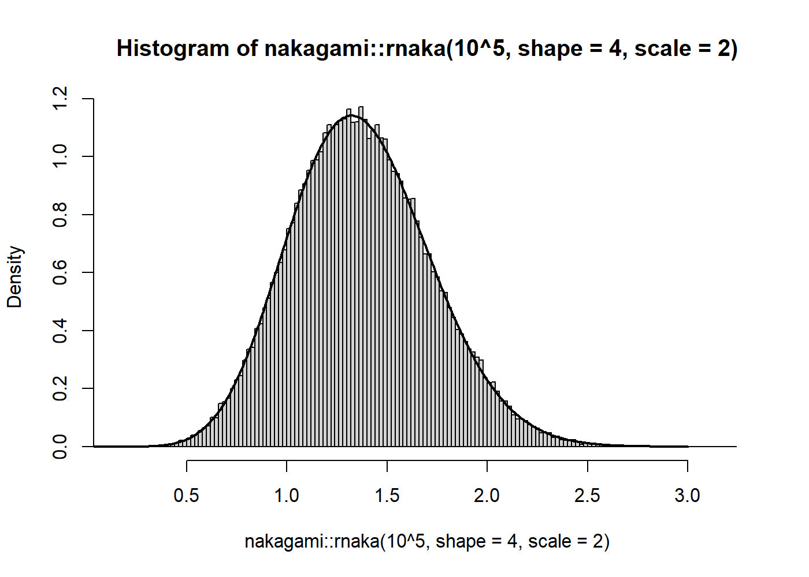

<!-- README.md is generated from README.Rmd. Please edit that file -->

# nakagami 

[](https://travis-ci.com/JonasMoss/nakagami)
[](https://ci.appveyor.com/project/JonasMoss/nakagami)
[](https://codecov.io/gh/JonasMoss/nakagami?branch=master)
[](https://www.repostatus.org/#active)
[](https://cran.r-project.org/package=nakagami)

## Overview

An `R`-package for the [Nakagami
distribution](https://en.wikipedia.org/wiki/Nakagami_distribution).

## Installation

Use the following command from inside `R`:

``` r
# install.packages("devtools")
devtools::install_github("JonasMoss/nakagami")
```

## Usage

The density function is `dnaka`, the probability distribution is
`pnaka`, the quantile function is `qnaka` and random deviate generator
is `rnaka`. Use them just like the `*gamma` functions in the `stats`
package.

``` r
set.seed(313)
x = seq(0, 3, by = 0.01)
hist(nakagami::rnaka(10^5, shape = 4, scale = 2), freq = FALSE, breaks = "FD")
lines(x, nakagami::dnaka(x, shape = 4, scale = 2), type = "l", lwd = 2)
```



## Note

All of these functions are implemented in the `R` package
[`VGAM`](https://cran.r-project.org/package=VGAM). As of `VGAM` version
1.1-2, the implementations in `nakagami` are faster, more thoroughly
tested, and use a standardized set of arguments following the template
of `dgamma` et cetera.

The `rnaka` of `nakagami` is much faster than the `rnaka` of `VGAM`:

``` r
#install.packages("VGAM")

microbenchmark::microbenchmark(nakagami::rnaka(100, 2, 4), 
                               VGAM::rnaka(100, 4, 2))
#> Unit: microseconds
#>                        expr    min      lq      mean median      uq
#>  nakagami::rnaka(100, 2, 4)  265.9  303.45   553.702  352.6  430.25
#>      VGAM::rnaka(100, 4, 2) 2028.3 2355.35 17558.350 2670.4 3040.85
#>        max neval
#>    15697.2   100
#>  1480179.6   100
```

And the quantile function of `nakagami` is slightly faster.

``` r
p = 1:10/11
microbenchmark::microbenchmark(nakagami::qnaka(0.01, 10, 4), 
                               VGAM::qnaka(0.01, 4, 10))
#> Unit: microseconds
#>                          expr   min     lq     mean median     uq      max
#>  nakagami::qnaka(0.01, 10, 4) 143.6 170.10 2117.254 201.65 293.25 183790.6
#>      VGAM::qnaka(0.01, 4, 10) 345.9 389.55  565.839 464.65 585.10   2706.5
#>  neval
#>    100
#>    100
```

Moreover, `VGAM::qnaka` fails to implement the standard argument `log.p`
and `VGAM::rnaka` uses the non-standard arguments `Smallno` and `...`.

## How to Contribute or Get Help

If you encounter a bug, have a feature request or need some help, open a
[Github issue](https://github.com/JonasMoss/nakagami/issues).

This project follows a [Contributor Code of
Conduct](https://www.contributor-covenant.org/version/1/4/code-of-conduct.html).

## References

  - Nakagami, N. 1960. “The m-Distribution, a General Formula of
    Intensity of Rapid Fading.” In Statistical Methods in Radio Wave
    Propagation: Proceedings of a Symposium Held at the University of
    California, June 18–20, 1958, edited by William C. Hoffman, 3–36.
    Permagon Press.
    <https://doi.org/10.1016/B978-0-08-009306-2.50005-4>.

  - Yee TW (2010). “The VGAM Package for Categorical Data Analysis.”
    Journal of Statistical Software, 32(10), 1–34.
    <https://www.jstatsoft.org/v32/i10/>.
